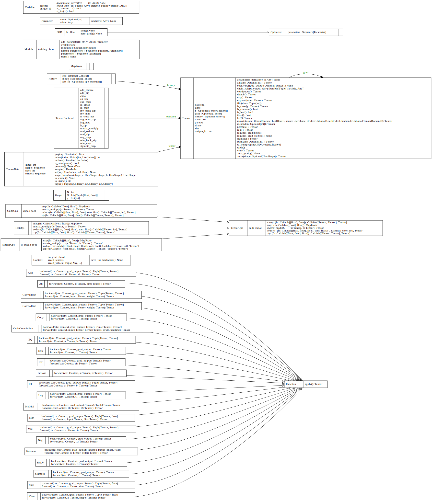
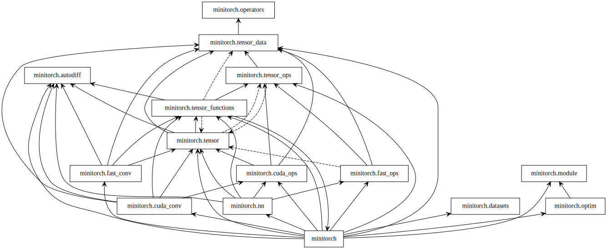

# My_MiniTorch

This is fully implemented minitorch for learning the structure of modern ml training, inferencing framework

* Docs: https://minitorch.github.io/

For further info and usage of minitorch, please refer to the above link.

# minitorch: backbone of my_minitorch
The diagram of classes

The diagram of packages

## Tensor
Tensor is the basic datatype of ml framework.

### `minitorch::tensor` 
The implementation of tensor class. The class contains a `backend`, which indicates the tensor is on cpu-mem or gpu-vmem, and which computational resource will this tensor use (i.e. cpu or gpu). Meanwhile, it also contains the implementation (coupled with `tensor_functions::Function`) of basic operation of tensors.

BP methods in `minitorch::tensor::Tensor` is based on `minitorch::autodiff`

### `minitorch::tensor_functions`
The implementation of functions related to tensor. Mostly coupled with `minitorch::tensor_ops`, which is the protocal of tensor operators.

### `minitorch::tensor_ops`
This module defines `TensorOps` and `TensorBackend`. `TensorOps` is a protocal, we have several derived class, `SimpleOps`, `FastOps` and `CudaOps`.

`SimpleOps`: the naive implementation of `TensorOps`.

`FastOps`: the cpu multi-threads implementation of `SimpleOps`.

`CudaOps`: the cuda multi-threads implementation.

`XXXBackend`: the wrapper of `XXXOps`, implementing complex tensor functions by calling ops from `XXXOps`.

## Autodiff

### `autodiff::Variable`
The protocal of variable classes in framkework. Basically refers to `Scalar` class and `Tensor` class.

### `autodiff::Context`
The class for recording the information through bp, basically for compute the grad w.r.t. current Variable

### `autodiff::backpropagate`
The function is for bp, first calling `topological_sort` to get the sorted list of Variable in the model, then find the grad of each Variable w.r.t. the model output

## Module
`minitorch::module` is the backbone of minitorch, just like pytorch. All models are combination of modules. The members in the module class contains `_module` and `_parameters`, which are sub-modules and parameters of this module.

Furthermore, the `minitorch::module::Parameters` is a wrapper of Variables.

## Efficiency
The efficiency improvement is made by `numba`. For cpu-mem scenario, the improvement is made by parallism. For gpu-vmem scenario, is cuda multi-thread.

The key improvement is `minitorch::cuda_ops::CudaOps`, where the cuda ops are implemented (like `CudaOps::matrix_multiply`). 

As for convolutional network, the cuda-kernel of conv2d is implemented as well. We use `minitorch::cuda_conv::im2col_cuda` to "unfold" the input matrix that each col is the flatted scope of the kernel. Then we flatten the kernel as well to perform the matmul for calculating the conv2d.
